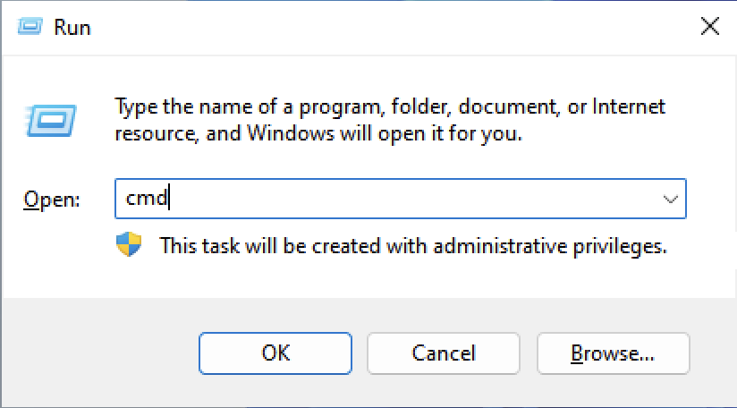
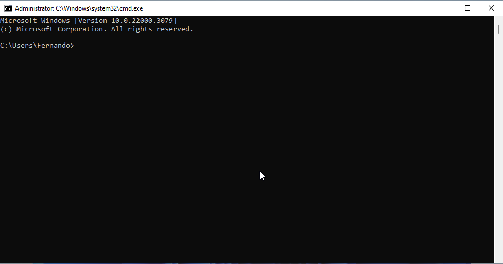
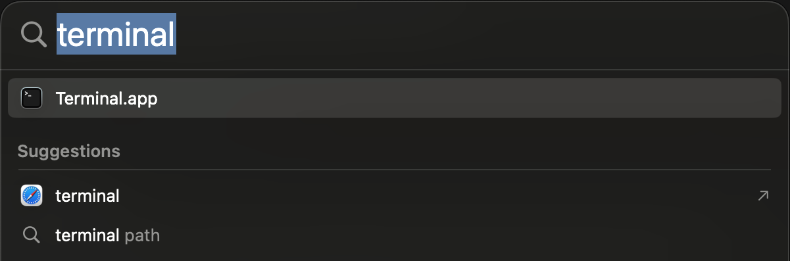
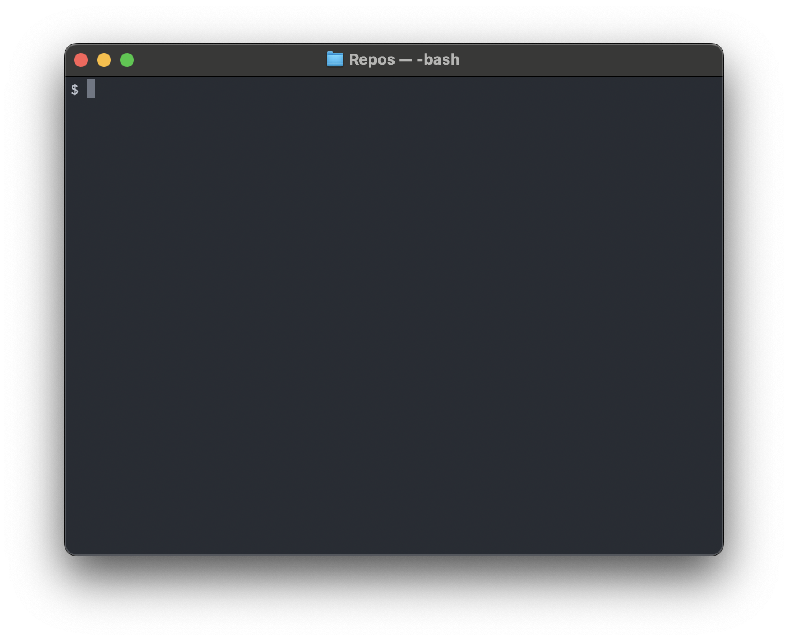

# Consola

## Primero lo primero... ¿qué es la consola del sistema operativo?

La consola, también llamada terminal, interfaz de comandos o línea de comandos,
es una interfaz que nos permite enviar **comandos** a nuestro sistema operativo
por medio de una línea de texto.

Pero, ¿porqué es importante conocer la consola? Nos permite **mayor control**
sobre el sistema operativo y las aplicaciones, nos permite **ejecutar un
conjunto de comandos** para automatizar tareas (scripts) y utilizamos **menos
recursos** del sistema operativo (memoria, CPU).

Ya sea que utilices Windows o Mac OS, aquí vamos con una introducción
básica a los comando que utilizaremos, pero recuerda, la consola es muy potente
y tendrás cientos de comandos que nos pueden resultar útiles.

## ¿Cómo iniciar la consola?

Depende del sistema operativo.


Hay varias formas. Una es presionar simultáneamente <kbd>![Windows]</kbd>+<kbd>R</kbd>,
escribrir `cmd`, y presionar <kbd>Enter</kbd>.






También hay varias formas. Una es presionar <kbd>⌘
Command</kbd>+<kbd>Spacebar</kbd>, escribir `terminal`, y presionar <kbd>Enter</kbd>.






:question: ¿Cómo abrir la línea de comandos desde Windows Explorer? Navega hasta
la carpeta que quieras abrir en la línea de comandos, haz clic con el botón
secundario del mouse, y utiliza el comando **Open in Terminal**:


</p>


:question: ¿Cómo abrir la terminal desde Finder en Mac OS? En caso de que tu
Finder no muestre la barra de carpetas, usa el comando **Show Path Bar** en el
menú **View** para mostrarla; luego navega hasta la carpeta que quieras abrir
luego, haz clic con el botón secundario del mouse en la barra de carpetas, y
utiliza el comando **Open in Terminal**:


También es posible iniciar la consola desde Rider, haciendo clic en el icono

que aparece en la barra de herramientas vertical izquierda. Es lo más
recomendable si estás trabajando en un proyecto en Rider y debes usar la
consola:


Rider abre la terminal en la carpeta donde está el proyecto que tienes abierto,
lo cual suele ser sumamente práctico.

## ¿Cómo ejecutar un comando?

Escribe el comando —o pega un comando previamente copiado desde el
portapapeles— y presiona <kbd>Enter</kbd>. Por ejemplo, el comando `echo`
imprime en la consola lo que sigue al comando:

```bash
echo Esto es una consola
```

En lo que acabas de ejecutar `echo` es el comando y `Esto es una consola` es un
parámetro. Un parámetro de un comando es una información adicional que se
proporciona a un comando para especificar cómo debe ejecutarse. Los parámetros
pueden ser opciones o argumentos que modifican el comportamiento del comando. En
este caso, el parámetro indica qué es lo que queremos que se imprima.

Al ejecutar el comando verás el resultado:

```bash
Esto es una consola
```

> [!TIP]
> Las teclas <kbd>↑</kbd> y <kbd>↓</kbd> te permiten ver los comandos que has
> ejecutando antes; es útil para repetir un comando sin tener que escribirlo
> nuevamente. Una vez que has llegado al comando deseado, puedes editarlo, o
> presionar <kbd>Enter</kbd> para ejecutarlo.

El comando `echo` funciona igual en Windows y en MacOS. Otros comandos son
diferentes dependiendo del sistema operativo que estés usando.

## Directorios, archivos, rutas absolutas y relativas

Un directorio es una ubicación que puede contener archivos y otros directorios.
Es similar a una carpeta y se utiliza para tus archivos organizados.

Cuando usas la consola, estás ubicado en un directorio, que se llama el
directorio actual o directorio de trabajo.

Para saber cuál es ese directorio, ejecuta el comando

`cd` o

`pwd`.

Muchos comandos reciben archivos o directorios como parámetro. Para indicar
dónde está el archivo o el directorio tenemos que indicar su ruta. Las rutas
pueden ser absolutas o relativas:

- Ruta absoluta: Se especifica la ruta desde la raíz. Por ejemplo
  `C:\Users\lucho\archivo.txt` en el caso de Windows o
  `/Users/lucho/archivo.txt` en el caso de Mac OS. En ambos casos el archivo
  `archivo.txt` está en la carpeta `lucho`, que a su vez está en la carpeta
  `Users`, que a su vez está en la raíz. En este ejemplo la raíz es `C:\` en
  Windows y `/` en Mac OS.
- Ruta relativa: Se especifica la ruta desde el directorio acutal, por eso es
  relativa. Por ejemplo, si el directorio actual es `C:\Users\lucho` o
  `/Users/lucho`, la ruta relativa hacia el archivo sería `.\archivo.txt` o
  `./archivo.txt` en Windows o Mac OS respectivamente. El `.` se traduce como
  "el directorio actual".

  También se puede escribir `..` para hacer referencia al directorio "padre" del
  directorio actual, es decir, el directorio que contiene el directorio actual.

Ya habrás notado que Mac OS utiliza el símbolo `/` para la estructura de
directoris y Windows utiliza el símbolo `\` (aunque Windows lo entiende de ambas
formas).

Aunque parezca más complejo, es importante que te acostumbres a usar rutas
relativas. Muchos archivos de un proyecto hacen referencia a otros archivos, si
usas rutas relativas, no importa dónde esté el proyecto.

> [!TIP]
> Cuando tengas que escribir nombres de carpetas o archivos como parámetros en
> un comando, escribe las primeras letras y oprime <kbd>Tab</kbd>; verás como
> se completa con el nombre de la carpeta o archivo que comience con las letras
> que has escrito. Esto evita que tengas que escribir todo el nombre. Si hay más
> de un nombre que comienza con las letras que haz escrito, continúa oprimiendo
> <kbd>Tab</kbd> hasta que aparezca el que deseas.

## Listar el contenido de un directorio: sus archivos y directorios

Para ver un listado de los archivos y directorios en un directorio, podemos
utilizar el comando

`dir` o

`ls`.

Si no usamos ningún parámetro, veremos como resultado el listado de archivos y
directorios en el directorio actual; veremos lo mismo si usamos `ls .` o `dir
.`.

Para ver los archivos y directorios del directorio padre, usamos `ls ..` o `dir
..`.

## Cambiar el directorio actual a otro directorio

Ahora necesitamos movernos en el sistema de archivos y eso lo hacemos con el
comando `cd`. Esto por suerte, funciona igual en todos los sistema operativos.
Así que si estamos en el directorio `/Users/lucho` y queremos ubicarnos en el
directorio `Desktop` que está en `/Users/lucho`, ejecutaremos `cd Desktop` y
ahora estamos en el directorio que llamamos hijo. ¿Recuerdas cuando mencionamos
que `..` hace referencia al directorio padre cuando hablamos de rutas relativas?
Con `cd ..` volvemos a ubicarnos en la carpeta padre.

<!-- ### Creando y borrando

Me gustaría crear un nuevo directorio. No hay problema `mkdir` (Windows, Linux, Mac) seguido por un nombre adecuado nos permite hacerlo. La nueva carpeta se crea en la ubicación actual, es decir será una carpeta hija.

¿Y si quiere borrar?  Ya sea que estemos borrando un archivo o una carpeta, `rmdir` (Windows, Linux, Mac) seguido por el nombre del recurso a borrar nos permite eliminar **definitivamente** el mismo.

### Renombrando archivos

Si quiero cambiar el nombre de un archivo, en Linux/Mac, ejecuto el siguiente comando: `mv nombreviejoarchivo1.extension nombrenuevoarchivo1.extension`.
Su equivalente en Windows es `rename nombreviejoarchivo1.extension nombrenuevoarchivo1.extension` (en lugar de `rename` también se puede utilizar `ren`).

A continuación un ejemplo básico:
Tengo un archivo de extensión **txt**, con nombre **Viejo** y quiero renombrarlo a **Nuevo**. El comando en Linux/Mac sería `mv Viejo.txt Nuevo.txt`. Para este mismo caso en Windows será `rename Viejo.txt Nuevo.txt`. -->

## Algunos comandos útiles

|Funcionalidad|Windows|Linux|
|-|-|-|
|Mostrar los comandos disponibles|help|help|
|Mostrar ayuda de un comando `comando`|comando /?|comando --help|
|Salir del terminal|exit|exit|
|Apagar el sistema|shutdown|halt|
|Ver la versión del sistema operativo|ver|uname -a|
|Limpiar la pantalla|cls|clear|
|Imprimir un mensaje en pantalla|echo|echo|
|Ver la carpeta actual|cd, chdir|pwd|
|Cambiar de directorio|cd, chdir|cd|
|Listar contenido de un directorio|dir|ls|
|Listar contenido de un directorio en forma de árbol|tree|tree|
|Crear un directorio|md, mkdir|mkdir|
|Borrar un directorio|rmdir|rm|
|Cambiar nombre de un directorio|rename|mv|
|Crear un archivo vacío|echo > archivo|touch archivo|
|Borrar archivo|del, erase|rm|
|Cambiar nombre de un archivo|rename|mv|
|Mostrar contenido de un archivo|type|cat|
|Mostrar atributos del archivo|attrib|ls -l
|Copiar archivos|copy|cp|
